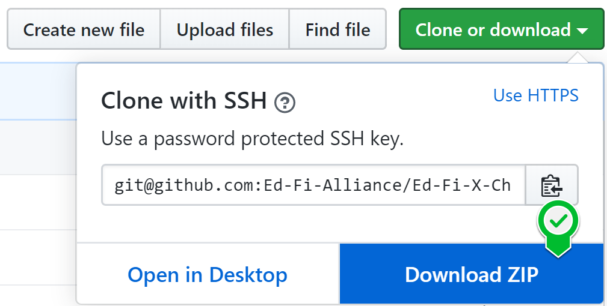
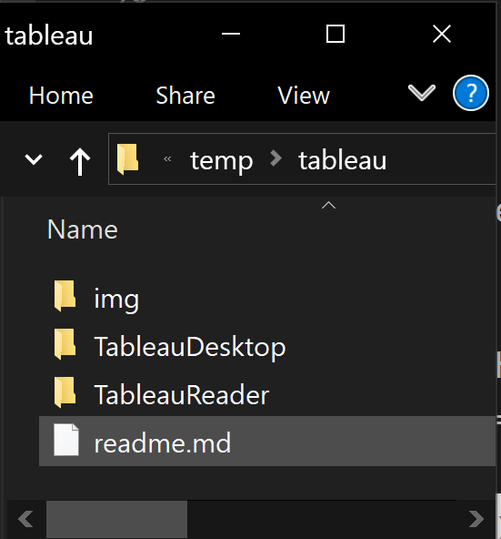
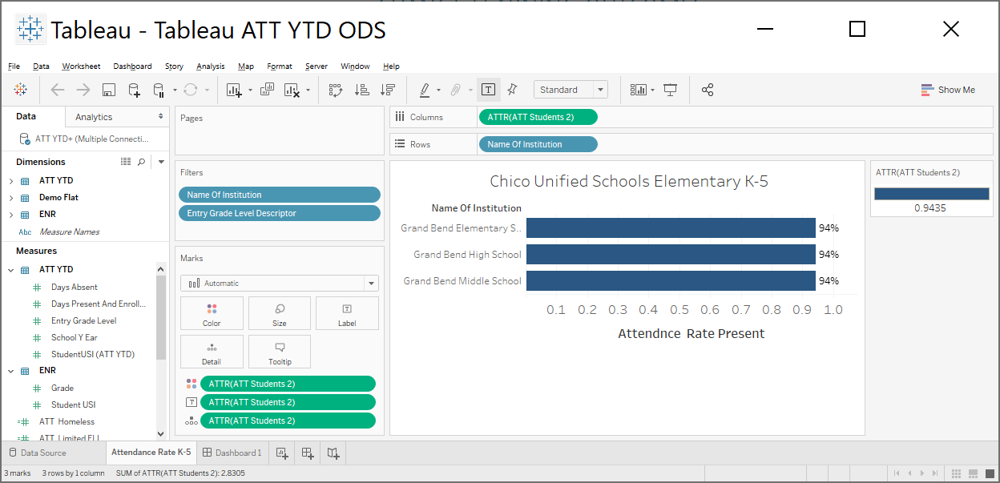
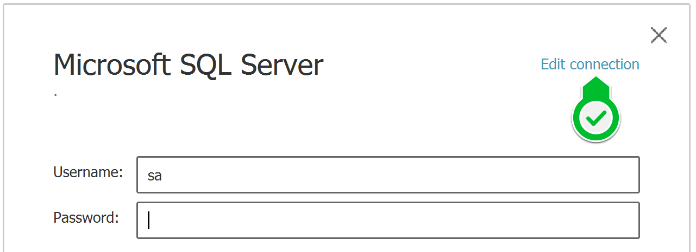

# Chronic Absenteeism Reports for Tableau
## Contributed by Chico Unified School District

These Chronic Absenteeism reports for Tableau were made possible thanks to the efforts of Chico Unified
School District in Chico, California.

## Description

This repository contains 2 folders that have 3 Tableau report folders each. These
reports are the same in each folder. The main difference is that we have built a
set using Excel as the data source to be able to see the reports with the
free Tableau Reader.

The reports cover the reporting needs for Chico Unified School District based
out of Chico, California. Here is a list of what is included:

* Attendance YTD
* Suspensions YTD
* Absence Impact Analysis

## Prerequisites

We recommend that the following prerequisites are installed on the machine that
you are planing to use to run the reports on.

*Note: These reports were written against an Ed-Fi ODS v2.6.0 version and have
not been tested with other versions.

### For Viewing the Sample Reports

1. (Free) Tableau Reader 2020.1 or higher. If you have no need to modify the
   data and you are just exploring the reports we recomend you install Tableau
   Reader.

### For Running the Reports Against a Live Database

1. Tableau Desktop 2020.1 or higher.
2. Ms SQL Server 2016 or higher with a v2.6.0 Ed-Fi ODS populated template.
3. MS-SSMS: Microsoft's Sql Server Management Studio 2016 or higher.
4. An Ed-Fi ODS v2.6.0 Database. We reocmmend the EdFi_Ods_PopulatedTemplate or
   you could use your staging or production database.

That is it =)

## How to Run the Reports

1. Download the reports in zip format  
   
2. Unzip them to a known location like C:\temp\ed-fi\tableau\  
   
3. Open Tableau and go to File -&gt; Open
4. Navigate to the path where you unziped the files
5. If using Tableau Reader make sure you open the folder named "TableauReader".
   If using Tableau Desktop open the "TebleauDesktop" folder.
6. Open the desired report. For exmaple: ~/ATTN YTD/Tableau ATT YTD ODS.twbx
7. You should see the report and dashboard (as depicted below)  
   

## How to Run the Reports with Your Data

* Ensure you have access to your EdFi ODS Database. If you don't you can use an
  "Ed-Fi ODS Populated Template Database" that contains GrandBend sample data.
* Open Tableau Desktop and go to File -&gt; Open then chose file located in
  ~\TableauDesktop\ATTN YTD\Tableau ATT YTD ODS.twbx
* Once it opens it will ask you to enter the password for the database 'sa'
  user. Click on the "Edit Connection" link on the top right corner.  
  
* Enter the settings to your Ed-Fi ODS Database and click the "Sign In" button.
* Tableau will show a modal executing query and then load the report.

## Legal Information

Copyright (c) 2020 Ed-Fi Alliance, LLC and contributors.

Licensed under the [Apache License, Version 2.0](LICENSE) (the "License").

Unless required by applicable law or agreed to in writing, software distributed
under the License is distributed on an "AS IS" BASIS, WITHOUT WARRANTIES OR
CONDITIONS OF ANY KIND, either express or implied. See the License for the
specific language governing permissions and limitations under the License.

See [NOTICES](NOTICES.md) for additional copyright and license notifications.